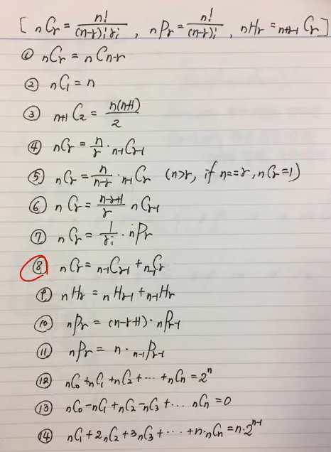

> # Computational Thinking 01
>> ###### 순열 조합

* ## 함수의 개수
  * 그냥 함수의 개수
    * X[m], Y[n] &rarr; nm
  * 단사 함수 ( 일대일 함수 : x ≠ y && f(x) ≠ f(y),  n(X) <= n(Y) )
    * X[m], Y[n] &rarr; nPm
  * 전사 함수 ( 공역 = 치역 )
    * X[m], Y[n] &rarr; (k: 0-n) &Sigma;(-1)knCk(n-k)m
  * 전단사 함수 ( 일대일 대응 )
    * m == n 이어야 함

---

* ## 공식 ? 들 ?
  6, 8, 9

---

* ## Problems
  * x + y + z = 10 (x, y, z는 자연수) x y z의 경우의 수 = 3H7
  * 교재 문제들 (강의 교안 말고)

---

* ## SWEA
  * 9760
  * 6719
  * 5607
