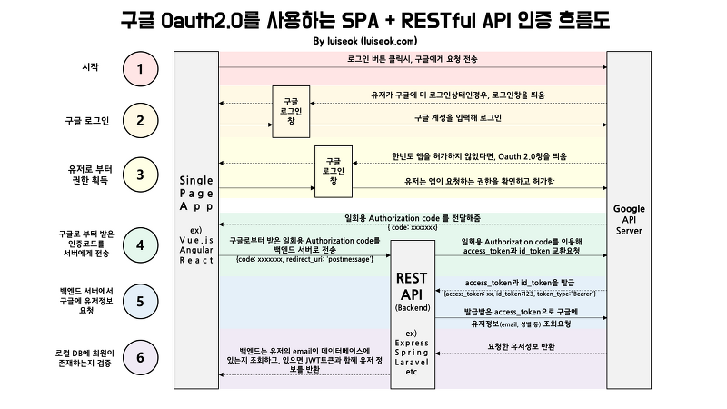

# Social Login Using Spring Security OAuth2




* **WebSecurityConfigurerAdapter**
  * ClientRegistrationRepository
    * Bean에 등록,
    * 커스텀 Provider(Kakao, naver 등등 보편적이지 않은 것) 정의해두고
    * ClientRegistration 리스트로 Repository에 등록
  
* **OAuth2AuthorizationRequestRedirectFilter**
  
  * ```java
    @Override
    protected void doFilterInternal(HttpServletRequest request, HttpServletResponse response, FilterChain filterChain)
            throws ServletException, IOException {
    
        try {
            OAuth2AuthorizationRequest authorizationRequest = this.authorizationRequestResolver.resolve(request);
            if (authorizationRequest != null) {
                this.sendRedirectForAuthorization(request, response, authorizationRequest);
                return;
            }
        } catch (Exception failed) {
            this.unsuccessfulRedirectForAuthorization(request, response, failed);
            return;
        }
    
        // ... 생략
    }
    ```
  
  * 소셜 로그인 요청 default url
    * {baseurl}/oauth2/authorization/{registraionid}
    * Repository에 등록되어 있는 registrationId 쭉 돌아봄
  * 인증 코드 요청
  * 후에 응답으로 받은 인증 코드로 accessToken을 요청
  
  
  
* **OAuth2LoginAuthenticationFilter**

  * code를 요청할 때 보냈던 redirect uri 로 oauth provider가 요청을 해줌
  * 이 필터가 그 요청을 받는데 default uri가
    * {baseUrl}/login/oauth2/code/{registrationId}
  * 성공하면 SuccessHandler 실행
  * 그리고 인증받은 회원 정보를 db에 저장하는 서비스도 커스터마이징해서 등록가능
    * attemptAuthentication 메소드 아래 부분에 authorizedClientService.saveAuthorizedClient() 함수를 실행하는 부분이 있음

* **OAuth2AuthroizedClientService**

  * 이 인터페이스를 구현해서 사용한다

  

  

